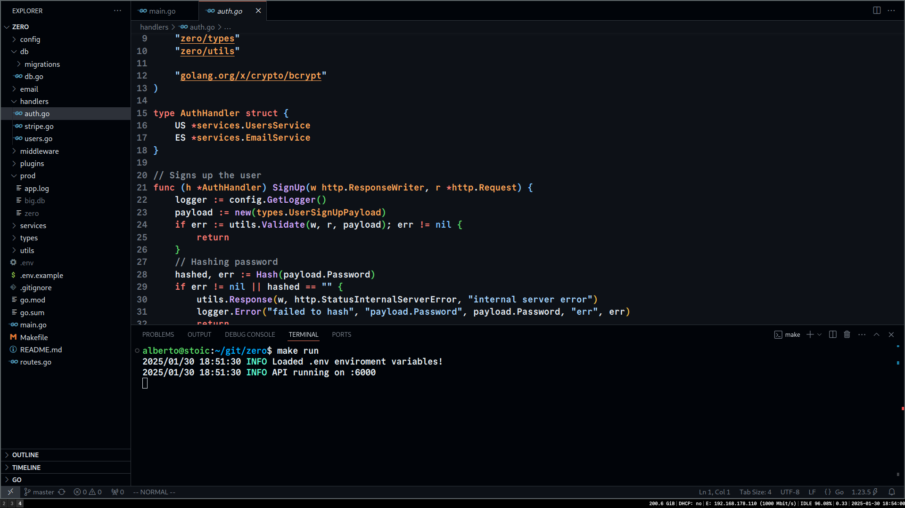
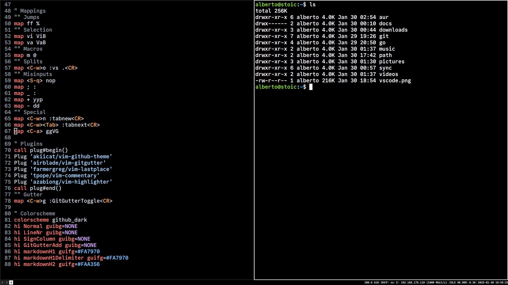
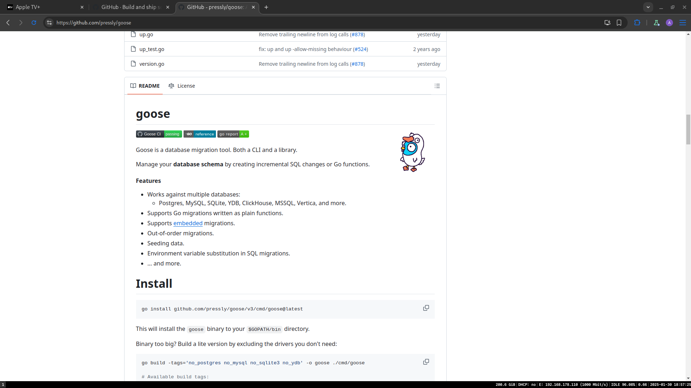
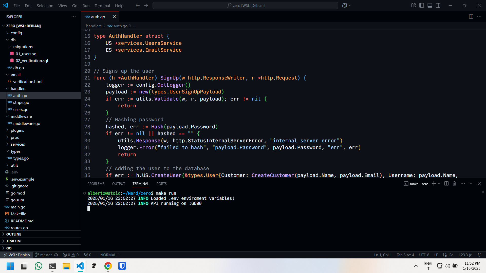
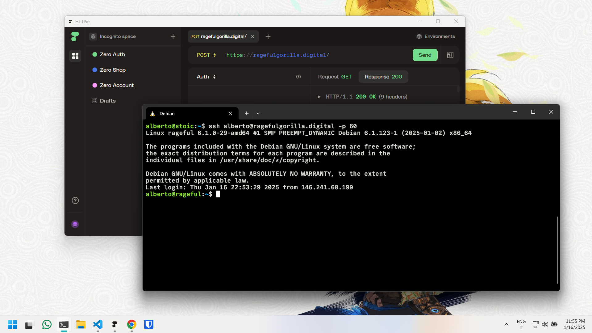

# Dotfiles
> I am now on **Artix** Linux after a productive year and a half on **Windows 11** with **WSL2** mostly programming in **Go**.

## Features
My system is created to be:
* Distraction free
* Comfy and pragmatic
* Kind of minimal
* Vim keys everywhere
* Dinit as PID 1
* LUKS encrypted

I accept tips, critiques and praises if you have them, just write to me at my mostly private [email](mailto://albertochdev@gmail.com)

Same goes if you find any typos or dead links!




This is how it looks. \
Nothing fancy, but fucking good.




Watching my favorite show with the codecs on using a fork of Chromium.

## Guide
This installation is for a **UEFI** system as we are in the modern era, but if you are running legacy BIOS you shouldn't have problems adapting
### Installing
#### Boot an Artix minimal ISO with dinit and become root
```sh
login: root
password: artix
```
#### Load your layout if it's not default us
```sh
loadkeys it
```
#### Partitioning
```sh
# Use lsblk to list device blocks
lsblk
# Use your favorite tool to partition
fdisk /dev/nvme0n1
# Crypt your desired partition(s)
cryptsetup luksFormat /dev/nvme0n1p2
# Open your encrypted partititon(s) to later mount them
cryptsetup open /dev/nvme0n1p2 cryptlvm
# Format your partitions
mkfs.fat -F 32 /dev/nvme0n1p1
mkfs.ext4 /dev/mapper/cryptlvm
mkfs.ext4 /dev/sda1
# Mount them
mount /dev/mapper/cryptlvm /mnt
mkdir /mnt/boot
mount /dev/nvme0n1p1 /mnt/boot
mkdir /mnt/secondary
mount /dev/sda1 /mnt/secondary
```
Let's say you are booted in the live and want to use gdisk instead which is not installed
```sh
pacman -Sy gdisk
```
You could use a different file systems like btrfs, xfs and zfs or use physical and logical volumes in a completely different way
#### Choose your mirrors
```sh
# Put your desired mirror at the top for speed considering default ones work fine
vim /etc/pacman.d/mirrorlist
```
#### Install base, the kernel of your choice and some more stuff on the mounted system
```sh
basestrap -i /mnt base base-devel dinit elogind-dinit linux linux-firmware amd-ucode cryptsetup lvm2 lvm2-dinit efibootmgr vim
```
#### Generate the fstab
```sh
fstabgen -U /mnt > /mnt/etc/fstab
```
Mine looks like this
```sh
# /dev/mapper/cryptlvm
UUID=6e410d6b-2b42-4348-8adf-a71109e005b8	/         	ext4      	rw,relatime	0 1

# /dev/sda1
UUID=a5385a8a-48f8-43cd-a833-d52709ef7444	/secondary	ext4      	rw,relatime	0 2

# /dev/nvme0n1p1
UUID=860D-3076      	/boot     	vfat      	rw,relatime,fmask=0022,dmask=0022,codepage=437,iocharset=ascii,shortname=mixed,utf8,errors=remount-ro	0 2
```
This is how your block devices will be mounted every time you boot
#### Chroot into the new system
```sh
artix-chroot /mnt
```
#### Link your timezone
```sh
ln -s /usr/share/zoneinfo/Europe/Rome /etc/localtime
```
#### Generate your locale(s)
```sh
# Uncomment required locale
vim /etc/locale.gen
# Then
locale-gen
```
#### Set your locale
```sh
echo LANG="en_US.UTF-8" > /etc/locale.conf
```
#### Set the keyboard language for ttys
```sh
echo KEYMAP="it" > /etc/vconsole.conf
```
#### Pick your hostname
```sh
echo "stoic" > /etc/hostname
```
#### Add basic hosts
```sh
vim /etc/hosts
```
```sh
127.0.0.1 localhost
::1		  localhost
```
#### Set root password
```sh
passwd
```
#### Create a standard user for yourself and maybe more
```sh
useradd -m -s /bin/bash -G wheel alberto
passwd alberto
```
#### Install plymouth
```sh
pacman -S plymouth
```
#### Edit your mkinitcpio if you use that(alternatives are dracut and booster)
```sh
vim /etc/mkinitcpio.conf
# Change this line adding encrypt, lvm2 and plymouth
HOOKS(base udev autodetect microcode modconf block filesystems keyboard fsck encrypt lvm2 plymouth) 
```
#### Install the bootloader
```sh
pacman -S grub efibootmgr plymouth
# Install grub in your esp
grub-install --target=x86_64-efi --efi-directory=/boot/efi --bootloader-id=GRUB
# Edit your grub configuration if needed
vim /etc/default/grub
```
Mine looks like this
```sh
GRUB_CMDLINE_LINUX_DEFAULT="loglevel=3 quiet splash rw cryptdevice=UUID=2d78ab1a-7879-420e-8585-d9e51b9d35cc:cryptlvm root=UUID=6e410d6b-2b42-4348-8adf-a71109e005b8"
# Boot from a LUKS encrypted partition
GRUB_ENABLE_CRYPTODISK=y
# Hide GRUB's menu
GRUB_TIMEOUT_STYLE=hidden
```
#### Generate the bootloader configuration
```sh
grub-mkconfig -o /boot/grub.cfg
```
You can always use efibootmgr if your bootloader doesn't create a working entry or doesn't create one at all
```sh
# This is what I did
efibootmgr -c -d /dev/nvme0n1 -p 1 -L Grub -l \efi\EFI\GRUB\grubx64.efi
```
```sh
# Get more themes for plymouth
git clone https://github.com/adi1090x/plymouth-themes.git
# Install a theme you like
sudo cp -r plymouth-themes/pack_1/colorful /usr/share/plymouth/themes
# Set the default theme
plymouth-set-default-theme -R colorful
```
#### Regenerate your initramfs
```sh
mkinitcpio -P
```
This will give you a cool boot splash animation like this one


#### Add repositories
```sh
vim /etc/pacman.conf
```
I use these repositories(I have omniverse on even though I haven't installed a single package from it)
```sh
# Artix
[system]
Include = /etc/pacman.d/mirrorlist

[world]
Include = /etc/pacman.d/mirrorlist

[galaxy]
Include = /etc/pacman.d/mirrorlist

[extra]
Include = /etc/pacman.d/mirrorlist-arch

[omniverse]
Server = https://artix.sakamoto.pl/omniverse/$arch # Sakamoto Days reference
Server = https://omniverse.artixlinux.org/$arch
```
Read more about [Artix repositories](https://wiki.artixlinux.org/Main/Repositories)
#### Installling packages
```sh
pacman -S xf86-video-amdgpu xf86-input-libinput amdvlk \
		  git gpg github-cli wget aria2 curl httpie rsync rclone zip unzip 7zip \
		  dhcpcd dhcpcd-dinit nftables nftables-dinit \
		  thermald thermald-dinit \
		  bluez bluez-dinit bluez-utils \
		  cronie cronie-dinit \
		  xorg-server xorg-server-common xorg-server-devel xorg-setxkbmap xorg-xinit xorg-xprop xorg-xrandr xorg-xsetroot xdg-user-dirs \
		  i3-wm i3status i3lock \
		  pipewire pipewire-dinit pipewire-pulse pipewire-pulse-dinit pipewire-alsa pipewire-audio pipewire-jack wireplumber pulsemixer \
		  go sqlite3 nodejs pnpm docker docker-dinit \
		  openssh openssh-dinit \
		  dmenu scrot less man-db \
		  alacritty otf-commit-mono-nerd noto-fonts noto-fonts-cjk noto-fonts-emoji \
		  nsxiv mpv yt-dlp zathura zathura-pdf-poppler typst \
		  vscodium gvim bitwarden obs-studio
```
I installed relevant drivers, if you have an Nvidia GPU you would install Nvidia drivers(nvidia) instead of AMD ones(xf86-video-amdgpu) and if you had an Intel CPU you would install Intel's micrcode(intel-ucode) instead of the AMD one(amd-ucode). 

You may need some other drivers based on your hardware(like xf86-input-libinput for touchpads), you are a big boy/girl you know what to do.

Details on possibly less known packages I am installing
* git is the world's most famous version control system and Github now has a CLI made in Go called gh
* httpie is a modern take on curl
* rclone is my favorite way to backup what I need on Google Drive and such
* dhcpcd is a good DHCP server and nftables are the successor of iptables if you want a firewall
* thermald is for better cooling
* those hand picked xorg packages provide me with HD(4K even) graphics to watch shows and porn, mostly porn and just kidding I don't
* my window manager of choice is i3, I have used bspwm, dk and sowm in the past, this is comfy
* audio is served by pipewire which I find nicer then pulseaudio
* docker is cool and I use it a lot
* nsxiv is the continuation of sxiv
* gvim will provide a vim build with display server clipboard support
#### Reboot into the new system
```sh
reboot
```
Something doesn't work? Slur.

(Then boot up your live enviroment again and mount everything to fix your install)

### Post Installation
#### Installing dotfiles
You know how to this.

Here are comments on some of them
* hosts/hosts is a curated host file blocking ads, malware and gambling sites
* nftables/nftables.conf are firwall rules to deny every incoming connection and allowing outbound leaving you the possibility to ssh -R
* vim/.vimrc it's my vim config, I know it's not that shiny but does the job on servers
* vscode/settings.json and vscode/keybindings.json my glorious visual studio code configuration with vim keys and clean interface
* zsh/.zshrc is an effective zsh configuration with colored man pages
* i3/config it's just really good
#### Configuring the browser
I always set the locale in Google's search engine to United States then install [uBlock Origin](https://ublockorigin.com) as a [necessary](https://youtu.be/Dab8sKg8Ko8?si=vn21rXxVjyRws1KH&t=153) adblocker and Youtube Unhook to hide Youtube's Home and Shorts because fuck them
#### Set your DNS if you don't like your router default ones
Check out [Blocky](https://github.com/0xERR0R/blocky)
```sh
vim /etc/dhcpcd.conf
```
```sh
# I use Cloudflare ones
static domain_name_servers=1.1.1.1 1.0.0.1
```
#### Enable services
```sh
dinitctl enable dhcpcd
dinitctl enable nftables
dinitctl enable cronie
dinitctl enable thermald
dinitctl enable bluetoothd
dinitctl enable dockerd
```
#### Install what you can't get from the repos
I install Thorium browser, HTTPie desktop, Spotify and go-mtpfs(to access Android devices storage) from the AUR!
```sh
# Installing something from the AUR without a helper like yay or paru
git clone https://aur.archlinux.org/httpie-desktop-bin
cd httpie-desktop-bin
makepkg -si
```
My .zshrc will add ~/path to $PATH for you to add stuff to it
```sh
# Installing go packages I need
go install github.com/go-delve/delve/cmd/dlv@latest
go install github.com/pressly/goose/v3/cmd/goose@latest
go install github.com/spf13/cobra-cli@latest
go install github.com/Zxilly/go-size-analyzer/cmd/gsa@latest
```
#### Add the user to relevant groups
```sh
usermod -aG video,audio,docker alberto
```
#### Optional
##### Backups on Google Drive
```sh
# Get a Google Drive's client_id and client_secret then
rclone config
```
```sh
# To backup a folder every day you could put something like this in /etc/cron.daily or use crontab
rclone sync /home/alberto/sync Sync:Sync
```
##### Setting up git globals and the Github CLI
```sh
git config --global user.name "Alberto Chiaravalli"
git config --global user.email "albertochdev@gmail.com"
git config --global core.editor "codium --wait"
gh auth login
```
##### Virtualize Windows 11 with KVM
```sh
pacman -S qemu virt-manager libvirt libvirt-dinit edk2-ovmf bridge-utils dnsmasq
dinitctl enable libvirtd
usermod -aG libvirt alberto
# Add virtualization modules
vim /etc/mkinitcpio.conf
```
```sh
MODULES="vfio vfio_iommu_type1 vfio_pci vfio_virqfd irqbypass kvm kvm_amd xhci_hcd"
# Reboot and install your virtual machine with virt-manager
```
You could also pass in a GPU with virtio to use graphical intensive applications like a video editor or games.

## FAQ
* Why would you put yourself through all this pain?
I am pretty sure I have mental issues.
* Are there any practical advantages to using this instead of Windows 11?
No, but you may have a greater probability not to be distracted and a system you can understand easier.
* Why dinit?
Using SystemD at work I felt like I wanted to try something different and I love this.
* You could have taken a different choice to make the system more minimal!
Sure, but I am still installing a browser on this making everything related to minimalism go out of the fucking window, again, I am not going for style point here I use this to work everyday.
* Something doesn't work on my side.
Sucks, I guess troubleshooting it's the price to pay.
* I love this and thank your for making me discover some of this stuff!
Thanks you are awesome, if you have something that you think I might not know to share please do! <!-- Instagram link -->

## How do I?
* Do anything related to audio? Use pulsemixer
* Connect to a bluetooth device? Use bluetoothctl
* Start a graphical session? Use startx, but you knew that didn't you?
* Get a better docker ps output? Search better-docker-ps on Google, I love it!
### I have another problem such as
* When I try to install Chrome or TikTok it says "error: target not found"
How did you come this far? Go to the nearest gym and read something, maybe checkout my resources repo
* I don't know how to use this
It's okay, just use Windows 11

## Tips
* Unlocking a user after some failed password attempts
```sh
faillock --user alberto -reset
```
* Startup programs that require administration privilages can go in
```sh
vim /etc/rc.local
```
* Bluetooth it's not working for you
```sh
#!/bin/sh
# rc.local for Artix -- enter your commands here
# it should be run when starting local.target service
rfkill unblock bluetooth
```
I start pipewire and use xinput to set my touchpad scrolling sensitivity in i3/config
* You can use ctrl+shift+space to go in vim mode inside alacritty

## Windows 11



Find my carefully crafted Windows Terminal config with a lot of themes included [here](./windows/terminal/settings.json)
