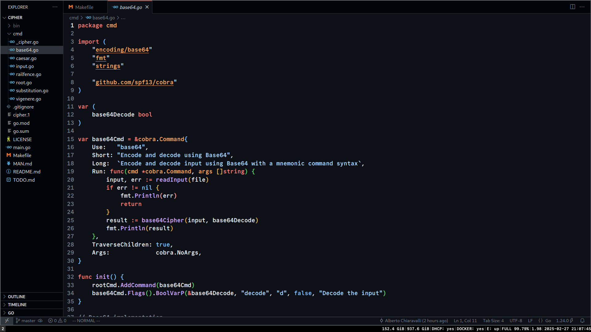

# Dotfiles
A collection of configuration files for a comfy and distraction free Artix installation

> I am now on **Artix** Linux after a productive year and a half on **Windows 11** mostly programming in **Go**.

## What are dotfiles?
Common term for the configuration files used in a system installation

## Features
* **Distraction free** for productivity and minimal overhead
* **Comfy and pragmatic** for everyday use and not exclusively for coding
* **Kind of minimal** for my usecase
* **Using vim keys everywhere** consistent keybidings across the whole system
* **Secure by default** with privacy and encryption

Write to me if you have any tips, critiques or praises, same goes if find a typo or a dead link!


This is how it looks, nothing fancy at all, but does the job.

## Guide
This installation is for a **UEFI** system as we are in the modern era, but if you are running legacy BIOS you shouldn't have problems adapting.
### Installing
#### Boot an Artix minimal ISO with dinit and become root
```zsh
login: root
password: artix
```
#### Load your layout if it's not default us
```zsh
loadkeys it
```
#### Partitioning
```zsh
# Use lsblk to list device blocks
lsblk
# Use your favorite tool to partition(I like fdisk)
fdisk /dev/nvme0n1
# Crypt your desired partition(s)
cryptsetup luksFormat /dev/nvme0n1p2
# Open your encrypted partititon(s) to later mount them
cryptsetup open /dev/nvme0n1p2 cryptlvm
# Format your partitions
mkfs.fat -F 32 /dev/nvme0n1p1
mkfs.ext4 /dev/mapper/cryptlvm
mkfs.ext4 /dev/sda1
# Mount them
mount /dev/mapper/cryptlvm /mnt
mkdir /mnt/boot
mount /dev/nvme0n1p1 /mnt/boot
mkdir /mnt/secondary
mount /dev/sda1 /mnt/secondary
```
Let's say you are booted in the live environment and want to use gdisk instead which is not installed
```zsh
pacman -Sy gdisk
```
You could use a different file systems like btrfs, xfs and zfs or use physical and logical volumes in a completely different way
#### Choose your mirrors
```zsh
# Put your desired mirror at the top for speed(default ones work fine)
vim /etc/pacman.d/mirrorlist
```
#### Install base, the kernel and more
```zsh
basestrap -i /mnt base base-devel dinit elogind-dinit linux linux-headers linux-firmware cryptsetup lvm2 lvm2-dinit efibootmgr vim
```
#### Install your drivers like CPU microcode(amd-ucode or intel-ucode), GPU drivers(xf86-video-amdgpu or nvidia) and more
```zsh
basestrap -i /mnt amd-ucode xf86-video-amdgpu xf86-input-libinput amdvlk
```
#### Generate the fstab
```zsh
fstabgen -U /mnt > /mnt/etc/fstab
```
Mine looks like this
```zsh
# /dev/mapper/cryptlvm
UUID=6e410d6b-2b42-4348-8adf-a71109e005b8	/         	ext4      	rw,relatime	0 1

# /dev/sda1
UUID=a5385a8a-48f8-43cd-a833-d52709ef7444	/secondary	ext4      	rw,relatime	0 2

# /dev/nvme0n1p1
UUID=860D-3076      	/boot     	vfat      	rw,relatime,fmask=0022,dmask=0022,codepage=437,iocharset=ascii,shortname=mixed,utf8,errors=remount-ro	0 2
```
This is how your block devices will be mounted every time you boot
#### Chroot into the new system
```zsh
artix-chroot /mnt
```
#### Link your timezone
```zsh
ln -s /usr/share/zoneinfo/Europe/Rome /etc/localtime
```
#### Generate your locale
```zsh
# Uncomment required locale
vim /etc/locale.gen
# Then
locale-gen
```
#### Set your locale
```zsh
echo LANG="en_US.UTF-8" > /etc/locale.conf
```
#### Set the keyboard language for ttys
```zsh
echo KEYMAP="it" > /etc/vconsole.conf
```
#### Pick your hostname
```zsh
echo "stoic" > /etc/hostname
```
#### Add basic hosts
```zsh
vim /etc/hosts
```
```zsh
127.0.0.1 localhost
::1		  localhost
```
#### Set root password
```zsh
passwd
```
#### Create a standard user(s)
```zsh
useradd -m -s /bin/bash -G wheel alberto
passwd alberto
```
#### Optionally install plymouth
```zsh
pacman -S plymouth
```
#### Edit your mkinitcpio if you use that(alternatives are dracut and booster)
```zsh
vim /etc/mkinitcpio.conf
# Change this line adding encrypt, lvm2 and plymouth(if you want it)
HOOKS(base udev autodetect microcode modconf block filesystems keyboard fsck encrypt lvm2 plymouth) 
```
#### Install the bootloader
```zsh
pacman -S grub efibootmgr
# Install grub(or whatever you might want to use like refind)
grub-install --target=x86_64-efi --efi-directory=/boot/efi --bootloader-id=GRUB
# Edit your grub configuration if needed
vim /etc/default/grub
```
Mine looks like this
```zsh
GRUB_CMDLINE_LINUX_DEFAULT="loglevel=3 quiet splash rw cryptdevice=UUID=2d78ab1a-7879-420e-8585-d9e51b9d35cc:cryptlvm root=UUID=6e410d6b-2b42-4348-8adf-a71109e005b8"
# Boot from a LUKS encrypted partition
GRUB_ENABLE_CRYPTODISK=y
# Hide GRUB's menu
GRUB_TIMEOUT_STYLE=hidden
```
#### Generate the bootloader configuration
```zsh
grub-mkconfig -o /boot/grub.cfg
```
You can always use efibootmgr if your bootloader doesn't create a working entry or doesn't create one at all
```zsh
# This is what I did(because it wasn't working)
efibootmgr -c -d /dev/nvme0n1 -p 1 -L Grub -l \efi\EFI\GRUB\grubx64.efi
```
#### Get a plymouth theme(if you installed it)
```zsh
# Get more themes for plymouth
git clone https://github.com/adi1090x/plymouth-themes.git
# Install a theme you like
sudo cp -r plymouth-themes/pack_1/colorful /usr/share/plymouth/themes
# Set the default theme
plymouth-set-default-theme -R colorful
```
#### Regenerate your initramfs
```zsh
mkinitcpio -P
```
This will give you a cool boot splash animation like this one


#### Add additional repositories
```zsh
vim /etc/pacman.conf
```
I use these
```zsh
# Artix
[system]
Include = /etc/pacman.d/mirrorlist
[world]
Include = /etc/pacman.d/mirrorlist
[galaxy]
Include = /etc/pacman.d/mirrorlist
[extra]
Include = /etc/pacman.d/mirrorlist-arch
# [omniverse]
# Server = https://artix.sakamoto.pl/omniverse/$arch
# Server = https://omniverse.artixlinux.org/$arch
```
Read more about [Artix repositories](https://wiki.artixlinux.org/Main/Repositories)
#### Installling packages
```zsh
pacman -S man-db gpg git github-cli wget aria2 curl rsync \
		  zip unzip 7zip \
		  dhcpcd dhcpcd-dinit \
		  nftables nftables-dinit \
		  thermald thermald-dinit \
		  bluez bluez-dinit bluez-utils \
		  cronie cronie-dinit \
		  xorg-server xorg-server-common xorg-server-devel xorg-xinit \
		  xorg-setxkbmap xorg-xprop xorg-xrandr xorg-xsetroot xdg-user-dirs xwallpaper \
		  i3-wm i3status i3lock dmenu scrot \
		  pipewire pipewire-dinit pipewire-pulse pipewire-pulse-dinit pipewire-alsa pipewire-audio pipewire-jack wireplumber pulsemixer \
		  go sqlite3 nodejs pnpm \
		  docker docker-dinit \
		  openssh openssh-dinit \
		  otf-commit-mono-nerd noto-fonts noto-fonts-cjk noto-fonts-emoji \
		  nsxiv mpv yt-dlp zathura zathura-pdf-poppler typst pandoc \
		  alacritty vscodium gvim bitwarden obs-studio 
```
Details on possibly less known packages I am installing
* git is the world's most famous version control system and GitHub now has a CLI made in Go called gh
* dhcpcd is a DHCP client server
* nftables are the successor of iptables for a firewall
* thermald is for better cooling
* those hand picked xorg packages provide me with HD(4K even) graphics to watch shows better
* my window manager of choice is i3(I have used bspwm, dk and sowm in the past and i3 is my comfy choice)
* nsxiv is the continuation of sxiv for opening images
* gvim will provide a vim build with display server and clipboard support


#### Reboot into the new system
```zsh
reboot
```
Something doesn't work? Slur.
(Then boot up your live enviroment again and mount everything to fix your install)

Did you install plymouth and it's looping? Switch to tty2 with Ctrl+Alt+F2 to login.

Now it's time to get my dotfiles or use your own.

### Post Installation
#### Add the user to relevant groups
```zsh
usermod -aG video,audio,docker alberto
```
#### Description of my dotfiles(for you to hand pick)
```
.
├── alacritty
│   └── alacritty.toml # my alacritty terminal emulator configuration
├── cron
│   └── crontab # backing up important files every hour
├── hosts
│   └── hosts # blocking ads, malware and gambling websites
├── i3
│   ├── config # my i3 window manager configuration
│   └── status
│       └── config # my i3 status bar configuration
├── nftables
│   └── nftables.conf # my nftables firewall configuration
├── README.md # the file you are reading right now
├── vim
│   └── .vimrc # my vim editor configuration
├── vscodium
│   ├── keybindings.json # my vscode keybindings
│   └── settings.json # my vscode configuration
├── windows
│   ├── terminal
│   │   └── settings.json # my old windows terminal configuration
│   └── wsl.conf # my old wsl configuration
├── xdg
│   └── user-dirs.dirs # defines where user directories should be and how they should be called
├── xorg
│   └── conf.d
│   │   └── 20-amdgpu.conf
│	└── .xinitrc # my .xinitrc responsible to determine what happens when xorg is launched(with startx)
└── zsh
    └── .zshrc # my zsh shell configuration
```


#### Set your DNS if you don't like your router default ones
Check out [Blocky](https://github.com/0xERR0R/blocky)
```zsh
vim /etc/dhcpcd.conf
```
```zsh
# I use Cloudflare ones
static domain_name_servers=1.1.1.1 1.0.0.1
```
#### Enable services
```zsh
dinitctl enable dhcpcd
dinitctl enable cronie
dinitctl enable nftables
dinitctl enable bluetoothd
dinitctl enable dockerd
dinitctl enable thermald
```
#### Install what you need from the AUR(Arch User Repository)
What do I install?
* thorium-browser-bin as my browser of choice(optimized Chromium fork)
* httpie-desktop-bin
* spotify
* cemu-bin WiiU emulator just because
* go-mtpfs-git to mount Android devices
```zsh
# Installing something from the AUR without a helper(like yay and paru)
git clone https://aur.archlinux.org/httpie-desktop-bin
cd httpie-desktop-bin
makepkg -si
```


#### Installing Go utilities
```zsh
go install github.com/Zxilly/go-size-analyzer/cmd/gsa@latest
go install github.com/go-delve/delve/cmd/dlv@latest
go install github.com/pressly/goose/v3/cmd/goose@latest
go install github.com/spf13/cobra-cli@latest
go install golang.org/x/tools/cmd/godoc@latest
go install golang.org/x/vuln/cmd/govulncheck@latest
go install github.com/0xalby/based@latest
go install github.com/0xalby/cipher@latest
```
#### Configuring the browser(because you are gonna use it a lot and so will I)
1. I always set the locale in Google's search engine to United States(preserving my sanity as a native italian man)
2. Set Thorium(or whatever browser you use) sensitive settings
3. Install [uBlock Origin](https://ublockorigin.com) as a [necessary](https://youtu.be/Dab8sKg8Ko8?si=vn21rXxVjyRws1KH&t=153) ad blocker and YouTube Unhook to hide YouTube's Home and Shorts


#### Setting up git globals and the Github CLI
```zsh
git config --global user.name "Alberto Chiaravalli"
git config --global user.email "albertochdev@gmail.com"
git config --global core.editor "codium --wait"
gh auth login
```
#### Optionally virtualize Windows 11 with Virt Manager and KVM
```zsh
pacman -S qemu virt-manager libvirt libvirt-dinit edk2-ovmf bridge-utils dnsmasq
dinitctl enable libvirtd
usermod -aG libvirt alberto
# Add virtualization modules
vim /etc/mkinitcpio.conf
```
```zsh
MODULES="vfio vfio_iommu_type1 vfio_pci vfio_virqfd irqbypass kvm kvm_amd xhci_hcd"
# Reboot and install your virtual machine with virt-manager
```
You could also pass in a GPU with virtio to use graphically intensive applications like a video editor or high end games in the virtual machine.

## FAQ
* Why would you put yourself through all this pain?
I am pretty sure I have mental issues.
* Are there any practical advantages to using this instead of Windows 11?
No, but you may have a greater probability not to get distracted and a system you can truly understand over time.
* Why dinit?
I have nothing against systemd I just prefer this.
* You could have taken a different choice to make the system more minimal!
Sure, but I am still installing a browser on this making everything related to minimalism go out of the window, again, I am not going for style point here I use this to study, work and watch shows everyday.
* Something doesn't work on my side!
I guess troubleshooting is the price to pay.
* I love this and thank your for making me discover some of this stuff!
You are welcome, if you need anything just hit me up.

## How do I?
* Do anything related to audio? Use pulsemixer
* Connect bluetooth devices? Use bluetoothctl
* Start a graphical session? Use startx, but you knew that didn't you?
### I have another problem such as
* When I try to install Chrome or TikTok it says "error: target not found"
How did you come this far? Go to the nearest gym and read something, maybe checkout my resources repo too.
* I don't know how to use this
It's okay, just use Windows 11 I did it for a long time and worked almost flawlessly.

## Tips
* Unlocking a user after some failed password attempts
```zsh
faillock --user alberto -reset
```
* Startup programs that require administration privilages can go in
```zsh
vim /etc/rc.local
```
Let's say bluetooth is not working for you
```zsh
#!/bin/sh
# rc.local for Artix -- enter your commands here
# it should be run when starting local.target service
rfkill unblock bluetooth
```
* You can use ctrl+shift+space to go in vim mode inside alacritty
It's so good

## Notes
I start pipewire and use xinput to set my touchpad scrolling sensitivity in i3/config be aware

## Windows 11
My old Windows 11 system


You can find my carefully crafted Windows Terminal configuration with a lot of themes included in this repository!
